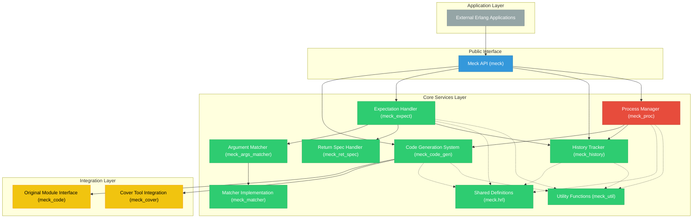

```mermaid
flowchart TB
    %% Styles
    classDef api fill:#3498db,stroke:#2980b9,color:white
    classDef core fill:#2ecc71,stroke:#27ae60,color:white
    classDef integration fill:#f1c40f,stroke:#f39c12,color:black
    classDef critical fill:#e74c3c,stroke:#c0392b,color:white
    classDef default fill:#95a5a6,stroke:#7f8c8d,color:white

    %% Application Layer
    subgraph AppLayer["Application Layer"]
        ExtApp["External Erlang Applications"]
    end

    %% Public Interface Layer
    subgraph PublicAPI["Public Interface"]
        MeckAPI["Meck API (meck)"]:::api
    end

    %% Core Services Layer
    subgraph CoreServices["Core Services Layer"]
        CodeGen["Code Generation System (meck_code_gen)"]:::core
        Expect["Expectation Handler (meck_expect)"]:::core
        History["History Tracker (meck_history)"]:::core
        ProcMgr["Process Manager (meck_proc)"]:::critical
        ArgMatch["Argument Matcher (meck_args_matcher)"]:::core
        RetSpec["Return Spec Handler (meck_ret_spec)"]:::core
        Util["Utility Functions (meck_util)"]:::core
        Matcher["Matcher Implementation (meck_matcher)"]:::core
        Defs["Shared Definitions (meck.hrl)"]:::core
    end

    %% Integration Layer
    subgraph Integration["Integration Layer"]
        OrigMod["Original Module Interface (meck_code)"]:::integration
        Cover["Cover Tool Integration (meck_cover)"]:::integration
    end

    %% Relationships
    ExtApp --> MeckAPI
    MeckAPI --> CodeGen
    MeckAPI --> Expect
    MeckAPI --> History
    MeckAPI --> ProcMgr
    
    CodeGen --> OrigMod
    CodeGen --> Cover
    
    Expect --> ArgMatch
    Expect --> RetSpec
    Expect --> History
    
    ProcMgr --> CodeGen
    ProcMgr --> History
    
    ArgMatch --> Matcher
    
    %% Shared Dependencies
    CodeGen -.-> Defs
    Expect -.-> Defs
    History -.-> Defs
    ProcMgr -.-> Defs
    
    CodeGen -.-> Util
    Expect -.-> Util
    History -.-> Util
    ProcMgr -.-> Util

    %% Click Events
    click MeckAPI "https://github.com/eproxus/meck/blob/master/src/meck.erl"
    click CodeGen "https://github.com/eproxus/meck/blob/master/src/meck_code_gen.erl"
    click Expect "https://github.com/eproxus/meck/blob/master/src/meck_expect.erl"
    click History "https://github.com/eproxus/meck/blob/master/src/meck_history.erl"
    click ProcMgr "https://github.com/eproxus/meck/blob/master/src/meck_proc.erl"
    click ArgMatch "https://github.com/eproxus/meck/blob/master/src/meck_args_matcher.erl"
    click RetSpec "https://github.com/eproxus/meck/blob/master/src/meck_ret_spec.erl"
    click Cover "https://github.com/eproxus/meck/blob/master/src/meck_cover.erl"
    click OrigMod "https://github.com/eproxus/meck/blob/master/src/meck_code.erl"
    click Defs "https://github.com/eproxus/meck/blob/master/src/meck.hrl"
    click Util "https://github.com/eproxus/meck/blob/master/src/meck_util.erl"
    click Matcher "https://github.com/eproxus/meck/blob/master/src/meck_matcher.erl"
```
